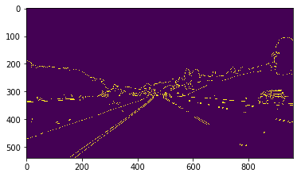

# **Finding Lane Lines on the Road** 

---

**Finding Lane Lines on the Road**

The goals / steps of this project are the following:
* Make a pipeline that finds lane lines on the road
* Reflect on your work in a written report

### Reflection

### 1. Describe your pipeline. As part of the description, explain how you modified the draw_lines() function.

My pipeline consisted of 5 steps:

* Step 1. Convert image to grayscale
* Step 2. Apply a Gaussian blur to grayscale
* Step 3. Apply Canny edge detection
* Step 4. Use mask to reduce unnessary edges
* Step 5. Apply Hough Transform

Edges</img> 
[image1]: ./result_image/01_edge.png      "Edges"
[image2]: ./result_image/02_line_edge.png "Line Edges"
[image3]: ./result_image/03_out_image.png "Output Image"

### 2. Identify potential shortcomings with your current pipeline

One potential shortcoming would be what would happen when it uses straight line to detect or mask curve lane.

### 3. Suggest possible improvements to your pipeline

A possible improvement would be to use B-Snake to do Lane detection and tracking.

* Paper:   Lane detection and tracking using B-Snake
* authors: Yue Wang, Eam Khwang Teoh, Dinggang Shen
* http://citeseerx.ist.psu.edu/viewdoc/download?doi=10.1.1.106.6644&rep=rep1&type=pdf

