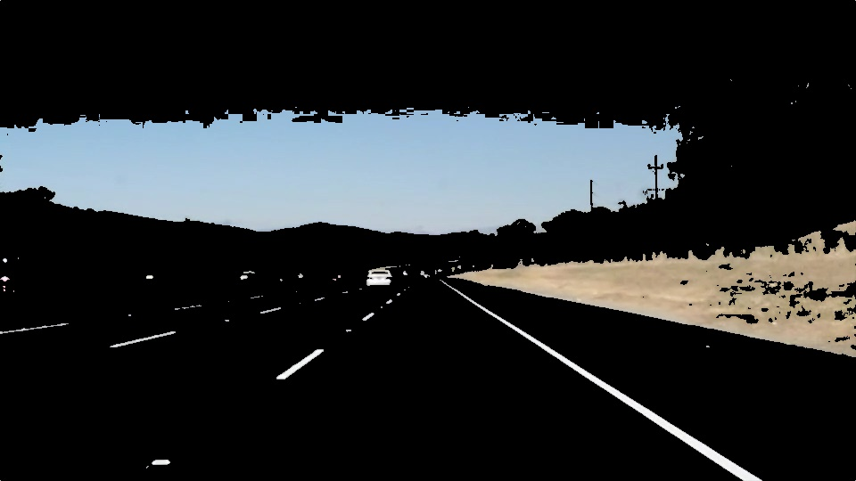
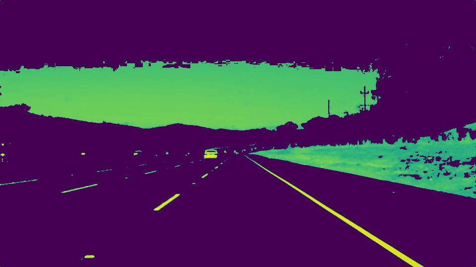
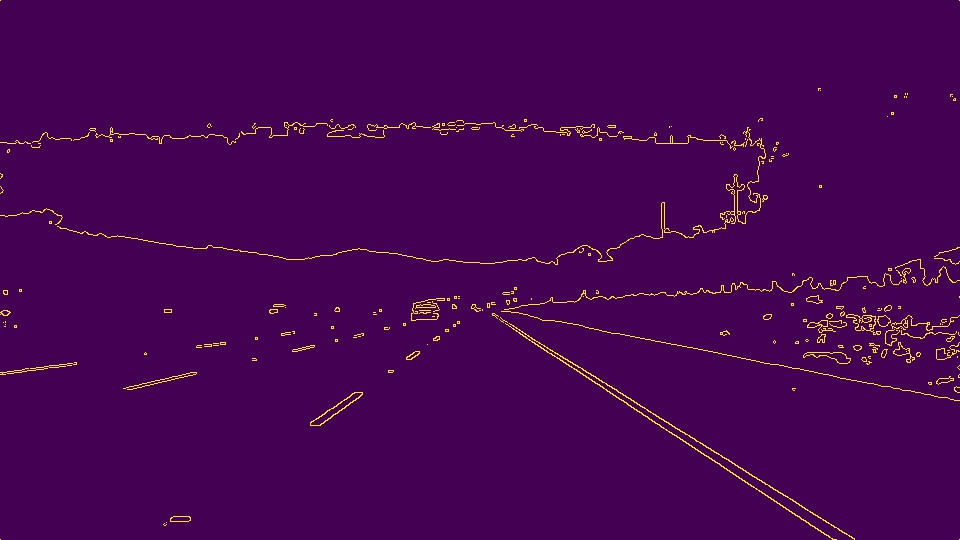
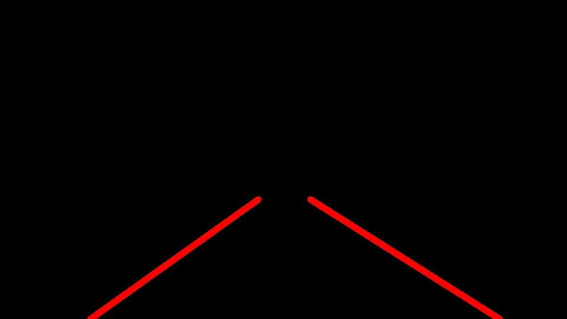
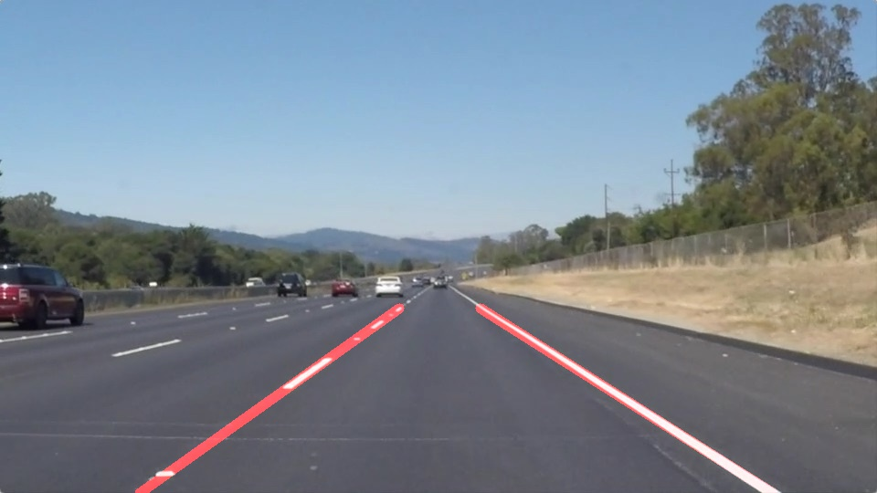

# **Writeup. Finding Lane Lines on the Road**

## 1. Description of the Pipeline

My pipeline for finding the lane lines consisted of 7 steps:
**Step 1**. Filter the image by selecting interesting colors, take this test image "solidWhiteRight.jpg" for example, here is its original look:

Here is the image after the filtering:

**Step 2**. Convert the color image to a grayscale image in order to simplify the calculation for the following steps, here is the output by converting the image from previous step:

**Step 3**. Apply the Gaussian blur to the grayscale image in order to get a smooth version of the image, here is the output by applying the Gaussian blur on the image from the previous step:

**Step 4**. Identify the pixel edges using the Canny edge detection, here is the output image with edges identified from the image from previous step:

**Step 5**. Select only the interesting regions that may include lane lines, here is the output image with interesting regions selected from the image from previous step:

**Step 6**. Detect lines in the image using the Hough Lines transform, and then mark them with red color. 

In order to draw a single line on the left and right lanes, I enhanced the draw_lines() function by using the *fitLine* function from OpenCV, which can fit a line to a point set. Before fitting the line, a threshold of the line slope is used to filter out noisy lines to avoid the impact from the lighting noises.

Here is the output image with Hough Lines transform based on the image from the previous step:

**Step 7**. Combine the original image and the lane lines, here is the final output image:

## 2. Potential Shortcomings
I honestly believe every step has its own shortcomings. Here I will just list a few that I can identify.

The **step 1** for filtering the image by selecting interesting colors, some useful colors could be filtered out. In this step, we throw away all the blue colors and red and green colors with lower values. That could have problems in the raining days or in the night, because the light is not very strong, the values of the useful colors could be low and got throw away.

The **step 5** for selecting only the interesting regions that may include lane lines, some useful regions could be dropped. For example, we throw away the upper half of the image, that could have problems when the car is changing lanes and moving uphill on a road because the lanes could appear in the regions that we throw away.

The **step 6** for detecting lines using the Hough Lines transform and extracting a single line out of the Hough Lines. This feels like the most difficult part of the pipeline, mostly because of the lighting noises. The lighting noises could bring a big impact on the accuracy of the output. The pipeline tries to handle some of the noises, but certainly there are lots of other noises it can't handle. The sources of the noises come from various objects, for example, the shadow of the trees or building alongside the road, the colorful objects on road, the lines of sidewalk, and etc.

## 3. Possible Improvements to the Pipeline
We can probably try to skip **step 1** because all the colors could be useful for identify lanes, at least in some conditions. For example, raining days, the nights, and etc.

We can probably try to skip **step 2** because all the regions could be useful for identify lanes. At least, we should skip step 2 in some special conditions and situations.

The **step 6** would definitely need some more advanced and complex noise filters and computer vision methods to make it more robust.