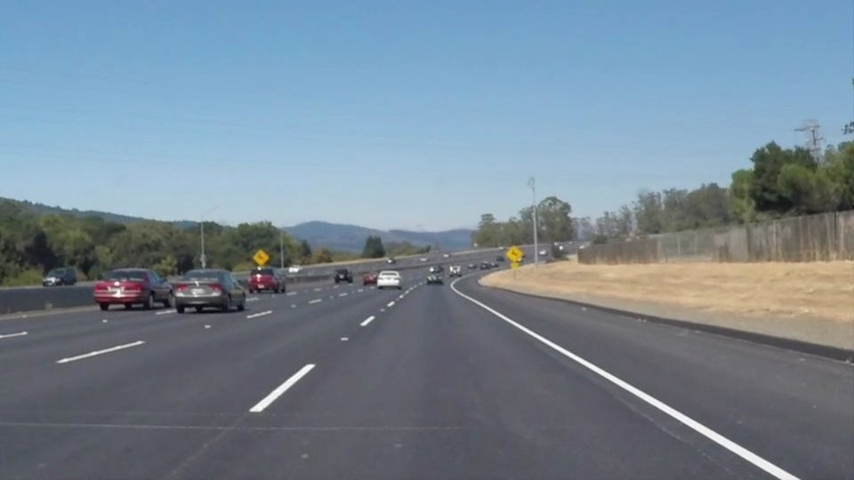
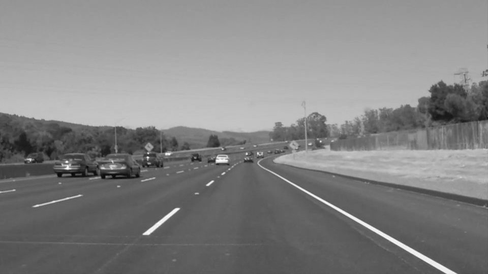
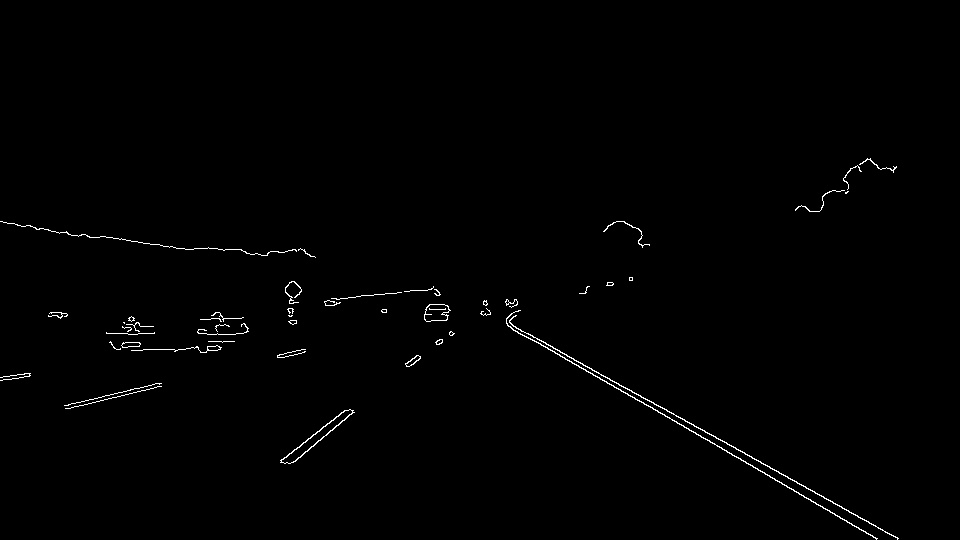
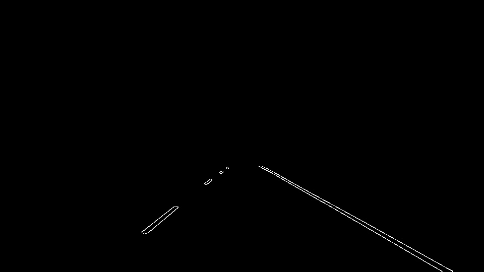
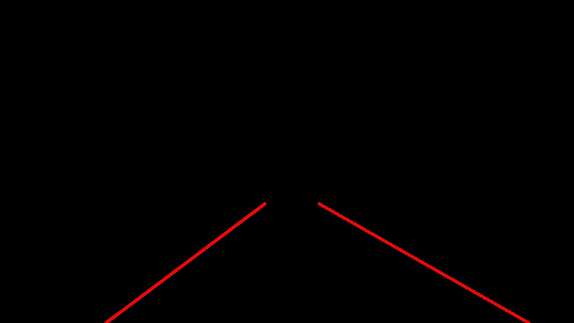
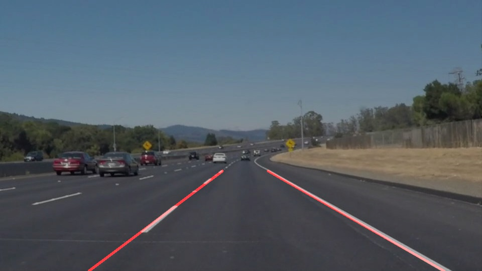

# **Lane Lines Project: Writeup** 

## Author
Michael McConnell

**Finding Lane Lines on the Road**

The goals / steps of this project are the following:
* Make a pipeline that finds lane lines on the road
* Reflect on your work in a written report

--- 
### Code
The code to detect lane lines can be found in the P1.ipynb file. The primary changes can be found in the process_single_img function which implements the computer vision pipeline for detecting lines. This detection is suplimented by an angle threshold and line averaging implemented in the draw_lines function. The resulting detected lane markings are overlayed on the provided images. Final output can be found in the test_images_output and test_video_output folders. 

[//]: # (Image References)

---

### Reflection

#### Pipeline

My pipeline consisted of 6 steps. 
##### 1. Convert image to greyscale
The intial image was converted to greyscale. This is done to get the image in a single channel form which can be processed by a canny edge detector used in future steps. Example of the conversion to greyscale can be seen below. 
 

*Base image before pipeline is applied*

 

*After image is converted to greyscale*

##### 2. Gaussian Blur
A gaussian blur is applied to reduce noise. A kernal of 5 was used which was found through trial and error. 
 

*Image after Gaussian Blur*

##### 3. Canny Edge Fliter
To identify the edges of lane markings a Canny Edge filter is applied with a Low Threshold of 120 and a High Threshold of 240. These threshold gradiant values were found through trial and error.  
 

*Image after Canny Edge detector is applied*

##### 4. Region of Interest (ROI)
After tuning, the edges detected with canny included some edges which were not part of the lane markings. To remove these a region of interest was marked around the vehicle's lane of travel.
 

*Image after region of interest was applied*

##### 4. Hough Line Transform
The edges remaining after the roi was applied were processed by Hough Line Transform to identify lines in the image. A rho of 2 and theta of 1 degree were used as the grid sizes in Hough Space. Lines were detected with an intersection threshold of 15. Lines were additonally filtered out by requireing a minimum pixel length of 20 and maximum line gap of 40 pixels. These values were found through trial and error.
 

*Image after region of interest was applied*

##### 5. Drawing lines
The lines returned from the Hough Line Transform were additionally filtered in the draw_lines function. Here the angle of each line was calculated and only lines in the range [35, 45] were kept. Using the sign of the calculated angle the lines were clustered into right and left sides. The lines on each side were then averaged and the resulting two lines drawn on the image. This provided the final result an example of which is shown below.
 

*Final image with averaged lane markings*

### Pipeline Weaknesses

This pipeline has some limitations. It requires extensive paramter tuning to develop, and, as was demonstrated by the challenge video, it struggles when barriers parallel to lane markings provide an alternative edge which is detected. This issue was compounded be the lack of color validation. Additionally, the lane markings must be well defined for this pipeline to work. Old worndown roads would certainly cause problems. 

### Pipeline improvements

The pipeline could be improved through the addition of a color filter to prevent edges from non lane markings be detected. 

Another improvement would be a comparison of the detected lane width. Since lane width is generally constand around the country it would provide a effective mechanism for filtering out detected lines. 
